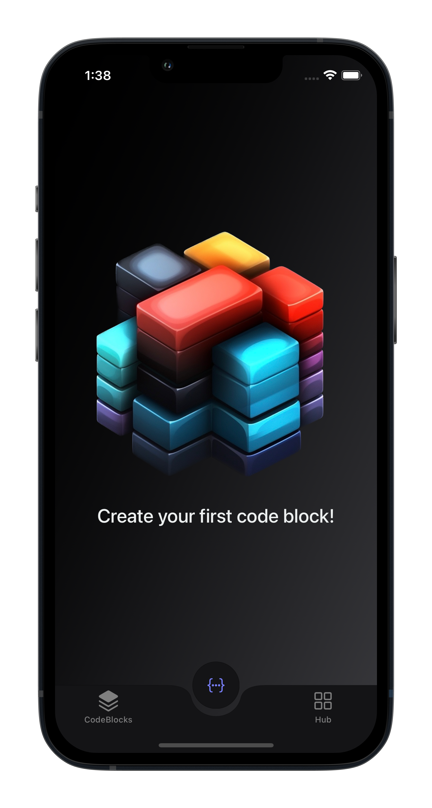
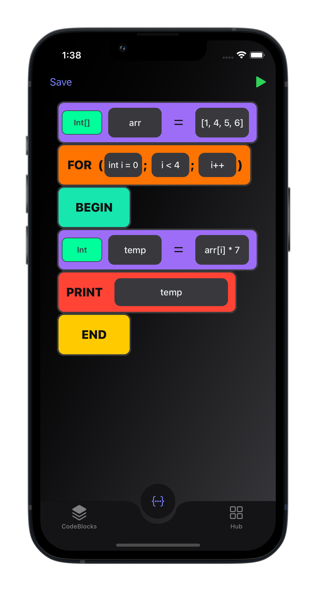
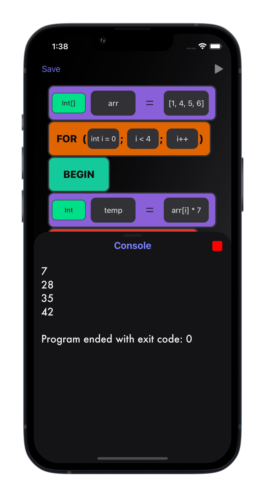
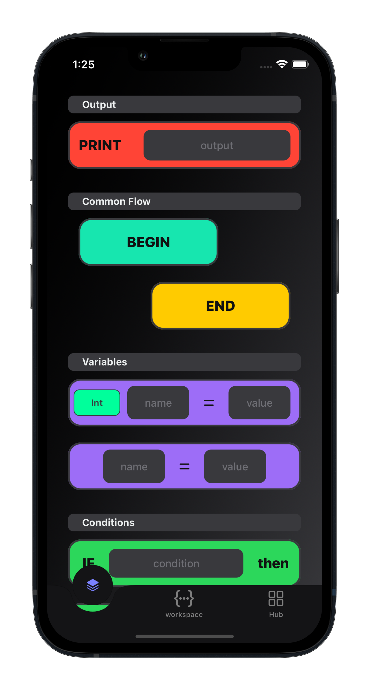
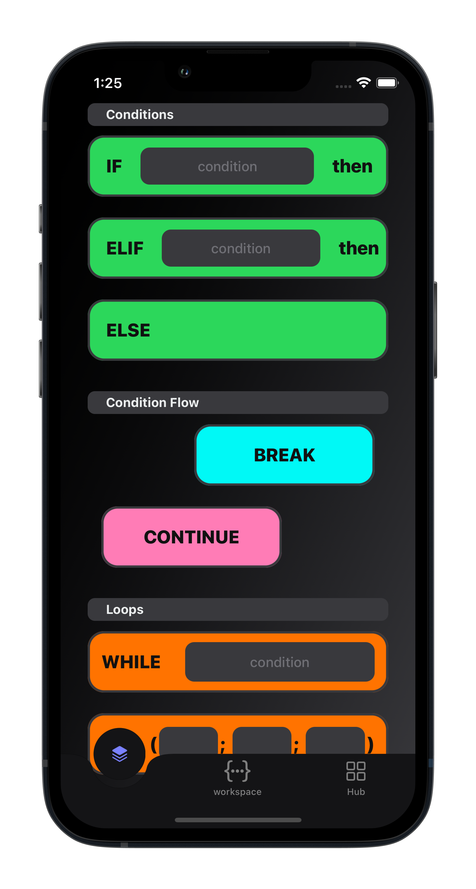
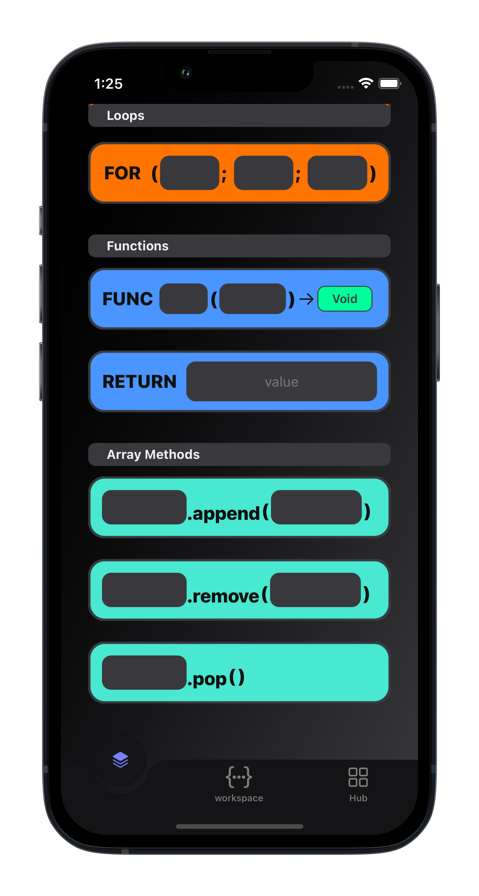
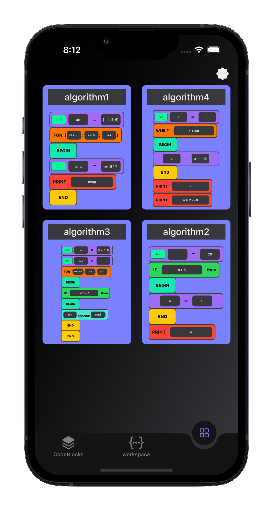

# 🔳 Block Interpreter

## 🛠 Used Tech
- Swift
- UIKit
- SnapKit
- FileManager
- Combine + CombineCocoa
- MVVM-C architecture

## 🎯 About

### 🎓 This project was completed as part of the educational module at the Higher IT School of TSU (Tomsk State University) on mobile development

### 📱 It was necessary to implement an algorithm interpreter in the form of a mobile application 

### ✅ App Features:

* Change the sequence of blocks on the workspace by drag and drop
* Wiggle mode
* 17 blocks are available for writing your algorithm
* Remove any block or all
* Block data is stored regardless of the current screen
* User can save his algorithm
* The preview of the saved algorithm uses its image
* Preview on the workspace
* Table of blocks with sections of block types

### ✅ Interpreter:
#### We utilized an [Abstract Syntax Tree (AST)](https://en.wikipedia.org/wiki/Abstract_syntax_tree) to construct and execute commands.
#### The features include:

* Variable declaration and initialization
* Support for complex arithmetic expressions with parentheses
* If, else-if, else statements
* Comparison operations and logical operators
* While and for loops
* Block scoping with begin/end
* Dynamic array declaration and manipulation (append, remove, pop)
* Element access by index
* Continue and break statements
* Logical operators with boolean values
* Function implementation with variable scope
* Support for multiple data types (int, double, bool, string)
* Type conversion and automatic type inference
* Type checking for variables
* String concatenation for any string types

## Demo ##

  

## Screenshots

    
    
    

    
    
    

    

## How to run

Clone or download the project and run `pod install`.

